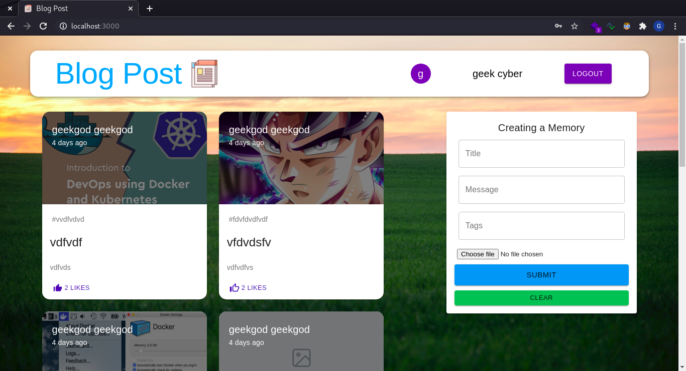

# Blog Post MERN Application
A MERN Application where user can post blogs with TITLE, MESSAGE, TAGS and IMAGES

The application has JWT authentication along with Google OAuth for the users to SignIn/Register.

# PREVIEW


# Prerequisites
* [nodejs](https://nodejs.org/en/)
* [npm](https://www.npmjs.com/get-npm)
* [Mongo ATLAS](https://www.mongodb.com/)

```bash
# Download this project
git clone https://github.com/geekCyberWarrior/blogPost.git
```

# SERVER SETUP
Before running the server you should, 
* set the database config in the ```server/.env``` file to the ```CONNECTION_URL``` variable

### INSTALLING DEPENDENCIES AND RUNNING
```bash
# Build and Run
cd server
npm install
npm start

# API Endpoint : http://127.0.0.1:5000
```

# CLIENT SETUP
Before running the client you should, 
* set the base url of the server in the ```client/.env``` file to the ```BASEURL``` variable
* set the Google Client ID in the ```client/.env``` file to the ```GOOGLECLIENTID``` variable

### INSTALLING DEPENDENCIES AND RUNNING
```bash
# Build and Run
cd client
npm install
npm start

# API Endpoint : http://127.0.0.1:3000
```
